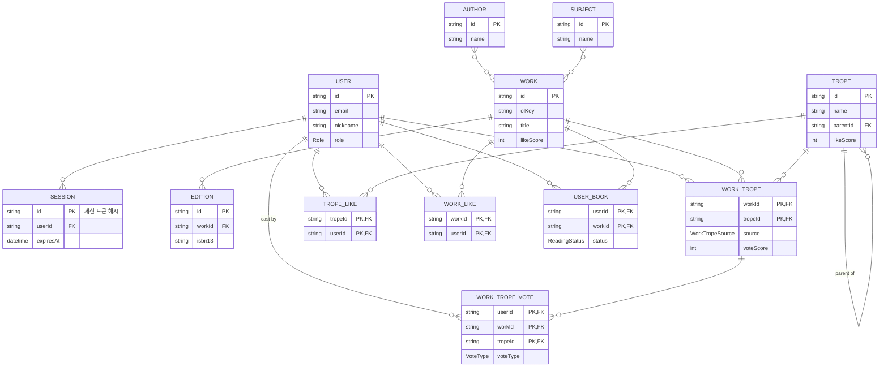

## 프로젝트 소개

- 배포 링크
  - web: https://storytrope.com
  - api doc: https://api.storytrope.com/docs

## 주요 기능

- 회원가입/로그인/로그아웃 (세션 쿠키 기반)
- 트로프(클리셰) 등록·조회, 하위 트로프 트리 구조
- 책(작품) 조회 (Open Library 데이터 기반)
- 책-트로프 연결 등록, 투표(업/다운)로 연결 신뢰도 검증
- 트로프 좋아요
- 트로프 랭킹 (주간/월간/연간)
- 관리자 페이지: 사용자·책-트로프 연결 관리, 책 등록·수정·삭제

## 기술 스택

- Back: TypeScript, NestJS, Prisma, PostgreSQL
- Front: Next.js, React, Tailwind CSS

## ERD



## 기술적 의사결정 및 트러블슈팅

### 세션 토큰을 DB에 해시로만 저장

세션 인증에서는 쿠키의 세션 식별자가 곧 인증 자격증명이므로, DB가 유출되면 저장된 식별자만으로 모든 세션을 탈취할 수 있다. 초기 구현은 Prisma의 `cuid()`를 세션 ID로 그대로 쿠키에 담았는데, cuid는 타임스탬프+카운터 기반이라 암호학적 난수가 아니고, DB에 원문이 남는 구조였다.

선택지는 세 가지였다: (1) cuid 유지, (2) CSPRNG 토큰을 평문 저장, (3) CSPRNG 토큰을 발급하되 DB에는 해시만 저장. (3)을 선택했다 — `crypto.randomBytes(32)` 토큰을 쿠키에만 담고, DB `Session.id`에는 SHA-256 해시를 저장한다. 토큰 원문은 서버 어디에도 남지 않으므로 DB가 유출돼도 세션 하이재킹이 불가능하다.

해시 함수로 bcrypt가 아닌 SHA-256을 쓴 이유: 비밀번호와 달리 토큰은 256비트 난수라 무차별 대입이 원천적으로 불가능해 느린 해시가 필요 없고, 매 요청마다 검증되므로 오히려 빠른 해시가 요구된다. 또한 해시를 별도 컬럼이 아닌 PK(`id`)로 사용해 스키마 변경 없이 조회 경로를 유지했다(cuid 기본값은 클라이언트 생성이라 DB 마이그레이션도 불필요).

검증: 단위테스트로 저장되는 값이 반환 토큰의 SHA-256 해시이며 원문과 다름을, 로그인마다 새 토큰이 발급됨을 확인한다(`auth.service.spec.ts`).

### 락 없는 동시 투표 처리

투표는 사용자당 하나만 유지되고(`WorkTropeVote`), 집계 점수(`WorkTrope.voteScore`)는 개별 투표를 매번 합산하지 않고 증분(increment)으로 갱신한다. 문제는 같은 사용자가 같은 트로프-책 조합에 동시에 두 번 요청을 보내는 경우다 — 최초 투표 두 개가 동시에 들어오거나, 투표를 뒤집는 요청 두 개가 동시에 들어올 수 있다. `SELECT`로 기존 투표를 확인하고 그 결과로 분기하는 구조라, 트랜잭션으로 감싸지 않으면 두 요청 모두 "기존 투표 없음"으로 판단해 `voteScore`에 델타를 두 번 적용하는 lost-update가 생긴다.

선택지는 두 가지였다: (1) 매 투표를 `SELECT FOR UPDATE`나 직렬화 트랜잭션으로 잠그기, (2) DB 제약을 이용한 락 없는 낙관적 동시성. (2)를 선택했다. 최초 투표 경합은 `(userId, workId, tropeId)` unique 제약으로 막는다 — 동시 insert 중 하나만 성공하고 나머지는 P2002로 실패하는데, 이때 실패한 쪽은 "이미 투표가 생겼다"는 뜻이므로 처음부터 다시 조회해 뒤집기 경로로 재시도한다. 뒤집기 경합은 `workTropeVote.updateMany`에 `where: { voteType: 기존값 }` 조건을 걸어 compare-and-swap으로 처리한다 — 조건이 안 맞아 `count === 0`이면 다른 요청이 먼저 뒤집은 것이므로 델타를 적용하지 않고 현재 점수만 다시 읽는다.

락 기반 방식보다 DB 커넥션을 오래 붙잡지 않아 처리량에 유리하고, 실패를 예외로 처리하는 대신 "재시도해야 할 상태"로 해석해 정상 흐름 안에서 처리한다.

검증: 두 시나리오 모두 단위테스트로 재현한다 — 동시 최초 투표 중 하나가 P2002로 실패하면 뒤집기 경로로 재시도해 델타가 정확히 반영되는지(`동시 최초 투표가 이기면 변경으로 재시도`), 동시 뒤집기에서 뒤늦은 요청이 `updateMany`에서 매칭 실패하면 델타를 중복 적용하지 않는지(`동시 뒤집기가 이미 있었으면 델타 중복 적용 안 함`) 확인한다(`work-tropes.service.spec.ts`).

### 리버스 프록시 뒤 rate limit을 위한 신뢰 홉 수 설정

`ThrottlerModule`은 `req.ip` 기준으로 사용자별 요청 수를 제한한다. 그런데 nginx 같은 리버스 프록시 뒤에서는 모든 요청의 TCP 연결이 프록시에서 오므로, Express가 별다른 설정 없이는 모든 사용자를 프록시의 IP 하나로 인식해 rate limit이 사용자별이 아니라 서버 전체에 걸린다. 프록시가 `X-Forwarded-For` 헤더에 실제 클라이언트 IP를 실어 보내므로, Express의 `trust proxy` 설정으로 이 헤더를 신뢰하게 하면 해결된다.

문제는 이 헤더가 클라이언트가 임의로 조작할 수 있는 일반 HTTP 헤더라는 점이다. 프록시 없이 서버가 인터넷에 직접 노출된 상태에서 `trust proxy`를 켜두면, 공격자가 매 요청마다 `X-Forwarded-For` 값을 바꿔가며 새 사용자인 척해 rate limit을 무제한으로 우회할 수 있다. 그래서 무조건 켜거나 끄는 대신, 실제 프록시 홉 수를 환경변수(`TRUST_PROXY_HOPS`)로 받아 그 개수만큼만 신뢰한다 — 값이 0(기본값)이면 신뢰하지 않고 소켓의 실제 접속 IP를 그대로 쓰고, 배포 환경처럼 프록시가 실제로 앞단에 있을 때만 값을 채워 켠다.

## 프로젝트 구조

```
apps/api/src
├── auth/         # 회원가입/로그인, 세션 발급·검증
├── users/        # 사용자 CRUD
├── works/        # 책(작품) 등록·조회
├── tropes/       # 트로프(클리셰) 등록·조회
├── work-tropes/  # 책-트로프 연결, 투표(좋아요/싫어요)
├── ranking/      # 트로프/책 랭킹 집계
├── prisma/       # PrismaService (DB 클라이언트)
└── common/       # 페이지네이션 등 공통 DTO
```

```
apps/web
├── app/          # 라우트 (책 목록/상세, 트로프 목록/상세, 랭킹, 로그인/회원가입)
├── components/   # 트로프/책 카드, 투표·좋아요 버튼, 등록 폼 등
└── lib/          # API 클라이언트, 인증 컨텍스트, 타입
```

## 시작방법

두 앱은 각각 독립된 pnpm 프로젝트다. 명령은 각 앱 디렉터리(`apps/api`, `apps/web`)에서 실행한다

- 요구사항: Node 22, pnpm 10
- 로컬: 호스트에 설치된 PostgreSQL 사용
- VPS: `apps/api`는 Docker Compose(db + 마이그레이션 + api)로 배포, `apps/web`은 빌드 후 실행(Vercel 등)

### 로컬 개발

**apps/api** — 로컬 PostgreSQL이 실행 중이어야 한다

```bash
cd apps/api
pnpm install
cp .env.example .env.local          # DATABASE_URL 등 값 채우기
pnpm exec prisma migrate dev        # 스키마 마이그레이션
pnpm exec prisma db seed            # (선택) 책 데이터 시드
pnpm start:dev                      # http://localhost:4000
```

**apps/web**

```bash
cd apps/web
pnpm install
# .env.local에 백엔드 주소 지정 (기본: http://localhost:4000)
echo "NEXT_PUBLIC_API_URL=http://localhost:4000" > .env.local
pnpm dev                            # http://localhost:3000
```

### VPS 배포

**apps/api** — 서버에서 Docker Compose로 db·마이그레이션·api를 함께 띄운다. api는 루프백(`127.0.0.1`)에만 바인딩되므로 앞단에 nginx 등 리버스 프록시를 둔다

```bash
cd apps/api
cp .env.docker.example .env         # POSTGRES_PASSWORD, JWT_SECRET, 도메인 URL 등 채우기
docker compose up -d --build        # db → migrate(prisma migrate deploy) → api 순으로 기동
```

**apps/web** — 정적/서버 렌더링 산출물을 빌드해 실행한다(Vercel 배포 또는 서버 직접 실행)

```bash
cd apps/web
pnpm install
# 프로덕션 백엔드 주소를 빌드 타임에 주입
echo "NEXT_PUBLIC_API_URL=https://api.storytrope.com" > .env.production
pnpm build
pnpm start                          # 기본 3000 포트
```

## 데이터 출처

책 데이터는 Open Library dump 파일에서 가져온다
